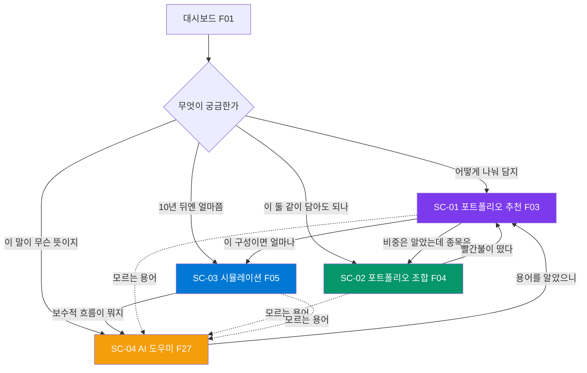

# 사용자와 시나리오

> - **버전**: v2.1
> - **최종 수정**: 2026-08-10 (KST)
> - **상태**: 초안
> - **기준 코드**: `main` @ `718f161`
> - **관련**: [프로젝트-개요](프로젝트-개요.md) · [범위와-비범위](범위와-비범위.md) · [기능ID-대장](../00-index/기능ID-대장.md)

---

## 0. 이 문서의 근거와 한계

**시나리오의 동작 부분은 전부 코드에서 확인한 것입니다.** 입력 항목·선택지·판정 기준·
출력 문구를 임의로 지어내지 않았고, 파일과 줄 번호를 함께 적었습니다.

**반면 페르소나(1절)는 가정입니다.** 실제 사용자 인터뷰를 하지 않았습니다.
근거로 삼은 것은 두 가지뿐입니다.

1. 강사님 자료가 제시한 **"사용자가 먼저 답하기 쉬운 질문" 4개** (`docs/07.md:143~146`)
2. 화면에 실제로 구현된 **입력 선택지의 문장** — 예를 들어
   "가격이 내려갈 때 내 마음은? / 불안해서 빠르게 줄이고 싶어요"
   (`portfolioGuide.js:97`) 는 이미 특정 사용자상을 전제하고 있습니다

→ 페르소나는 **R-06 ①(이해도 테스트)에서 검증하고 고칩니다.** 지금은 작업 가설입니다.

---

## 1. 사용자

### 1.1 P-01 · 주 사용자 — 처음 투자하는 비전공자

| 항목 | 내용 |
| --- | --- |
| **한 줄** | 목돈과 매달 남는 돈이 조금 있는데, 뭘 어떻게 시작해야 할지 몰라서 미루고 있는 사람 |
| **금융 지식** | "분산투자" 는 들어봤다. "공분산"·"샤프지수"·"백분위" 는 모른다 |
| **가장 두려운 것** | 넣자마자 떨어지는 것, 그리고 **그때 자기가 어떻게 반응할지 모르는 것** |
| **원하는 것** | 정답이 아니라 **출발점**. "이 정도면 시작해도 되겠다" 는 확신 |
| **원하지 않는 것** | "OO 를 사세요" 라는 단정. 그런 말이 나오면 오히려 못 믿는다 |
| **성공** | 자기 상황을 설명할 수 있게 되는 것 — "나는 7년 이상 볼 돈이고, 반토막 나도 안 팔 자신은 없다" |

> P-01 은 `docs/07.md:143~146` 의 4개 질문에 답할 수 있는 사람이면서,
> "공분산" 이라는 단어에서 화면을 닫는 사람입니다. 이 둘이 동시에 참인 것이 핵심입니다.

### 1.2 P-02 · 부 사용자 — 이미 굴리고 있는데 확인받고 싶은 사람

| 항목 | 내용 |
| --- | --- |
| **한 줄** | 종목 몇 개를 이미 들고 있고, 쏠려 있는 건 아닌지 궁금한 사람 |
| **주로 쓰는 것** | F04(조합 신호등) 하나만 반복해서 씀. 가진 종목을 둘씩 넣어 본다 |
| **원하는 것** | 짧은 확인. 긴 설명은 안 읽는다 |
| **성공** | 빨간불이 뜬 조합을 발견하고, 업종을 다시 본다 |

### 1.3 P-03 · 평가자 — 강사님·심사자

**실제로 이 사이트를 가장 꼼꼼히 볼 사람입니다.** 제품 사용자는 아니지만
성공 기준(S-01)을 판정하는 주체이므로 페르소나로 세웁니다.

| 항목 | 내용 |
| --- | --- |
| **보는 것** | 요구 4화면이 진짜 도는가 · 결과가 저장되는가 · 계층이 나뉘어 있는가 · 확정적 표현이 없는가 |
| **판단 방식** | 설명을 듣기 전에 **직접 눌러 본다.** 안 되는 링크를 하나 밟으면 나머지도 의심한다 |
| **이 사람 때문에 필요한 것** | 고정 URL(S-05) · 면책 문구 전면 적용(R-07) · 죽은 링크 0 |

> P-03 때문에 [CN-012](../00-index/변경이력.md#cn-012)(링크 없는 화면)가
> 단순 정리 문제가 아니라 **판정에 직결되는 문제**가 됩니다.

### 1.4 사용자가 아닌 사람

명시해 두지 않으면 기능이 계속 늘어납니다.

| 아닌 사람 | 왜 |
| --- | --- |
| 단타·데이트레이더 | 실시간 호가·주문이 없고, 앞으로도 안 만듭니다 ([범위와-비범위 2절](범위와-비범위.md#2-v20-에서-하지-않는-것)) |
| 기관·전문 투자자 | 무료 티어 기반이고 데이터 지연·정확도를 보장하지 않습니다 |
| 개발자 (API 소비자) | 공개 API 제품이 아닙니다. `/docs` 는 심사·개발용입니다 |

---

## 2. 지금 실제로 들어갈 수 있는 화면 — 40개가 아니라 9개입니다

시나리오를 쓰려면 **사용자가 어디로 갈 수 있는지**를 먼저 알아야 합니다.
여기서 이전 실측과 다른 사실이 나왔습니다.

| 구분 | 개수 | 근거 |
| --- | --- | --- |
| `app.js` 에 등록된 SPA 라우트 | **40** | `app.js:51` 의 `routes` 객체 |
| **사이드바에서 클릭으로 갈 수 있는 화면** | **9** | `index.html` 의 `data-view` **8개** + 정적 페이지 링크 1개 |
| 링크가 없어 주소를 직접 쳐야 하는 라우트 | **32** | 40 − 8 |

라우터는 해시가 아니라 **클릭 핸들러 + 쿼리스트링**입니다.

```js
// app/frontend/js/app.js:395~396
const requestedView = new URLSearchParams(window.location.search).get('view');
navigate(requestedView && routes[requestedView] ? requestedView : 'home');
```

즉 링크가 없는 32개는 `index.html?view=lstm` 처럼 **주소창에 직접 입력해야만** 열립니다.
`pages/youtube.html`(F29)은 `routes` 에도 없어 그 방법도 안 통합니다.

### 2.1 사이드바 9개 — 이미 요구 중심으로 짜여 있습니다

```
대시보드                        home            F01
├ 데이터 시각화 (접힘)
│  ├ 서버 리소스                server-resources F02
│  ├ 세계증시현황               world-markets    F11
│  └ 거래량 클라우드            volume-cloud     F10
├ 포트폴리오 조합               portfolio-combination  F04  ← R-02
├ 포트폴리오 추천               portfolio-guide        F03  ← R-01
├ 포트폴리오 시뮬레이션         portfolio-simulation   F05  ← R-03·R-05
├ 문서 검색 채팅                rag-chat               F27  ← R-04
└ 백테스트 실험실               pages/backtest-lab.html F28  (정적 페이지)
```

**요구 4화면이 전부 사이드바에 있습니다.** 정보구조 자체는 이미 요구를 향해 있습니다.
문제는 나머지 32개가 코드에는 있는데 화면에서 사라져 있다는 것입니다.
→ [CN-018](../00-index/변경이력.md#cn-018)

> **이 사실은 [CN-012](../00-index/변경이력.md#cn-012) 를 확대합니다.**
> 이전 세션은 "F29 하나가 링크되지 않는다" 로 봤지만, 실제로는 F06~F09 · F12~F26 을
> 포함한 **32개 라우트가 같은 상태**입니다. 정리 대상의 규모가 다릅니다.

### 2.2 전체 흐름



**F27(AI 도우미)이 나머지 셋 모두의 탈출구**라는 것이 이 그림의 요점입니다.
어느 화면에서든 모르는 말이 나오면 여기로 옵니다.
그래서 F27 의 품질 문제([범위와-비범위 1.2절](범위와-비범위.md#12-f27ai-투자-도우미에서-확인된-두-가지--q-02-답변))가
한 화면이 아니라 **네 화면 전부의 문제**가 됩니다.

---

## 3. 핵심 시나리오 4종

`docs/07.md:154~157` 의 "사용자가 보는 화면 예시" 4행을 그대로 시나리오로 풉니다.

### SC-01 · 포트폴리오 추천 (R-01 / F03)

**상황.** P-01 이 3,000만 원을 들고 있다. 어디에 얼마씩 넣어야 할지 모른다.

**하는 일 — 질문 3개에 답한다** (`portfolioGuide.js:95~97`)

| 질문 | 선택지 (원문 그대로) |
| --- | --- |
| 투자 목적 | 장기적으로 자산을 키우고 싶어요 / 성장과 안정의 균형이 필요해요 / 원금의 큰 흔들림이 걱정돼요 |
| 투자 기간 | 3년 이내 / **3년 ~ 7년** (기본) / 7년 이상 |
| 가격이 내려갈 때 내 마음은? | 불안해서 빠르게 줄이고 싶어요 / **상황을 보며 유지할 수 있어요** (기본) / 길게 보고 기다릴 수 있어요 |

> 세 질문이 `docs/07.md:143~146` 의 질문 ①②와 정확히 대응합니다.
> **금액을 묻지 않는다**는 점이 중요합니다. 비중만 다루므로 P-01 이 부담을 덜 느낍니다.

**판정 — 성향 3종 중 하나** (`portfolioGuide.js:39,133`)

```
목적이 "원금 걱정"            → 안정 중심
목적이 "자산 키우기" + 7년 이상 + 하락에 안 흔들림 → 성장 중심
그 외:  하락에 불안하거나 3년 이내  → 안정 중심
        하락에 안 흔들리고 7년 이상 → 성장 중심
        나머지                      → 균형 중심
```

**보여 주는 것 — 구성 + 자산별 역할** (`portfolioGuide.js:1~37`)

| | 안정 중심 | 균형 중심 | 성장 중심 |
| --- | --- | --- | --- |
| 글로벌 주식 | 20% | 45% | 60% |
| 국내 주식 | — | 15% | 20% |
| 채권·안정형 | 35% | 25% | 5% |
| 현금성 | 35% | 10% | 5% |
| 배당·방어형 | 10% | — | — |
| 대체 자산 | — | 5% | — |
| 테마·성장 | — | — | 10% |

각 자산에는 **역할 문구**가 붙습니다 — "급한 상황이나 기회를 위한 여유 자금",
"포트폴리오의 흔들림을 완화하는 역할", "장기 성장 기회를 위한 부분".
R-01 이 요구한 "자산별 역할" 이 이것입니다.

**불편함까지 함께 보여 줍니다.** "미리 알아둘 점" 에 성향별 단점을 답니다 —
성장 중심이면 *"짧은 기간에도 큰 손실이 발생할 수 있습니다. 생활에 필요한 돈은 별도로 두는 것이 좋습니다."*

**끝에 확인 3가지** (`portfolioGuide.js:102`): 생활비와 비상금 / 한 종목 쏠림 / 정기 점검.
→ `docs/07.md:143~146` 의 질문 ③④가 여기로 들어와 있습니다.

**샤프지수 모달의 정직함.** 이 화면에는 샤프지수 설명 모달이 있는데,
*"이 추천 화면은 샤프지수를 계산하지 않습니다"* 라고 **스스로 밝힙니다**
(`portfolioGuide.js:76`). 설명한 개념을 실제로 쓰지 않는다는 것을 숨기지 않는 태도입니다.

**얻는 답**: "나는 균형 중심이고, 주식 60% 채권 25% 현금 10% 정도가 출발점이구나."

| v2.0 에서 달라지는 것 | 왜 |
| --- | --- |
| **백엔드 호출이 생긴다** | 지금은 브라우저 안에서만 판정. 저장·재현·검증이 안 됨 (A등급인데 프론트 전용) |
| 결과가 계정에 저장된다 | 다음에 들어와도 내 성향이 남아 있음 |
| 하드코딩 3종 → 데이터 기반 | 지금 비중은 `PROFILES` 상수. 근거를 F06(MPT)와 연결 |

---

### SC-02 · 포트폴리오 조합 (R-02 / F04)

**상황.** P-02 가 삼성전자와 SK하이닉스를 둘 다 들고 있다. 나눈 걸까?

**하는 일.** 종목 둘과 기간을 넣는다. 예시 버튼 3쌍이 준비돼 있습니다
(`portfolioCombination.js:3~7`): `AAPL`/`JNJ` · `NVDA`/`KO` · `005930.KS`/`000660.KS`.

**판정 — 일간 변화율의 상관** (`main.py:1207~1218`)

| 상관 | 신호 | 화면 문구 |
| :---: | :---: | --- |
| **< 0.30** | 🟢 초록 | "최근 흐름이 비교적 다르게 나타났습니다. 함께 담을 때 한 종목에만 의존하는 정도를 낮추는 데 도움이 될 수 있습니다." |
| **0.30 ~ 0.70** | 🟡 노랑 | "최근에는 일부 구간에서 함께 움직였습니다. 분산 효과는 기대할 수 있지만 크기는 제한적일 수 있습니다." |
| **≥ 0.70** | 🔴 빨강 | "최근 가격 흐름이 자주 같은 방향으로 움직였습니다. 두 종목을 함께 담아도 분산 효과가 작을 수 있습니다." |

**화면에 "상관계수" 라는 말이 나오지 않습니다.** 코드 주석도 그렇게 적고 있습니다 —
*"화면에는 수식 대신 신호와 문장만 노출한다"* (`main.py:1202`).
이것이 이 프로젝트가 목적(2.1절)을 지키는 방식입니다.

**차트.** 두 종목의 가격 단위가 달라도 비교되도록 **출발선을 100 으로 맞춥니다**
(`main.py:1225`). 차트 밑에는 신호별로 다른 "차트 읽기" 문장이 붙습니다
(`portfolioCombination.js:40~44`).

**항상 다음 행동을 제안합니다.** 신호와 별개로 `hint` 가 나옵니다 —
빨강이면 *"한 종목의 영향이 다른 종목에도 이어질 수 있습니다. 업종이 다른 종목이나
다른 자산을 함께 검토해 보세요."* 신호등에서 끝내지 않는 설계입니다.

**얻는 답**: "이 둘은 빨간불이구나. 업종을 나눠야겠다."

| v2.0 에서 달라지는 것 | 왜 |
| --- | --- |
| 조회 이력이 저장된다 | P-02 가 같은 조합을 반복 조회함 |
| 면책 문구 추가 | 지금은 약한 주의만 있고 강한 면책이 없음 |

---

### SC-03 · 포트폴리오 시뮬레이션 (R-03·R-05 / F05)

**상황.** P-01 이 SC-01 에서 "균형 중심" 을 받았다. 그래서 10년 뒤엔 얼마가 되나?

**하는 일 — 투자 계획 4개** (`portfolioSimulation.js`)

| 입력 | 기본값 |
| --- | --- |
| 구성 성향 | 균형 중심 |
| 처음 투자할 금액 | 10,000,000원 |
| 매달 더할 금액 | 500,000원 |
| 투자 기간 | 10년 (3·5·10·20 중) |

**화면에 들어오자마자 기본값으로 한 번 돌립니다** (`portfolioSimulation.js` 마지막 줄 `simulate()`).
빈 화면을 보여 주지 않는 선택입니다.

**계산 — 5,000개의 가상 경로** (`quant.py:66~83`)

| 성향 | 연 기대수익률 | 연 변동성 |
| --- | --- | --- |
| 안정 중심 | 4.5% | 7% |
| 균형 중심 | 6.5% | 12% |
| 성장 중심 | 8.5% | 18% |

> 코드 주석이 스스로 밝힙니다 — *"These are illustrative assumptions,
> not forecasts or investable expected returns."* (`quant.py:65`)

매달 정규분포 난수로 수익률을 뽑아 5,000개 경로를 굴리고, 매년 말
**10 / 50 / 90 백분위**를 보수적·중간·긍정적으로 제시합니다.

**난수 시드가 고정돼 있습니다** (`quant.py:72`, `default_rng(20260806)`).
같은 입력이면 항상 같은 결과가 나옵니다 — 심사·테스트에는 유리하고,
"매번 다른 결과" 라는 오해도 막습니다.

**R-05 를 어떻게 지키는가.** 이 화면이 프로젝트에서 안전성 표현이 가장 잘 된 곳입니다.

| 위치 | 문구 |
| --- | --- |
| 상단 안내 | "한 번의 미래를 단정하지 않고, 다양한 시장 흐름을 많이 만들어 보는 방법입니다" |
| 모달 | "한 가지 예측 대신 수천 번의 서로 다른 시장 경로를 만들어 결과의 범위를 봅니다" |
| 모달 | "이는 확정된 미래가 아니라 **가능한 범위**를 이해하기 위한 참고값입니다" |
| 결과 카드 | "상황이 기대보다 좋지 않을 때의 참고 범위" / "여러 가상 결과의 가운데에 가까운 흐름" |
| 하단 면책 | "교육용 가정으로 만든 가상 결과입니다. … 미래 성과를 보장하지 않습니다" |

모달에는 **실제 `quant.py` 코드 스니펫까지** 넣어 계산 과정을 숨기지 않습니다.
[CN-008](../00-index/변경이력.md#cn-008) 이 이 모달을 공통 컴포넌트로 일반화하려는 이유입니다.

**얻는 답**: "중간이면 1억 2천쯤, 나빠도 9천쯤. 넣은 돈이 7천이니 최악에도 버틸 만하네."

| v2.0 에서 달라지는 것 | 왜 |
| --- | --- |
| 시뮬레이션 결과 저장 | 지난번 계획과 비교할 수 있어야 함 |
| 가정의 출처 표시 | 4.5%/7% 가 어디서 왔는지 지금은 알 수 없음. F13~F15(거시)와 연결 |

---

### SC-04 · AI 투자 도우미 (R-04 / F27)

**상황.** P-01 이 SC-03 에서 "보수적 흐름" 을 봤다. 손실이 확정됐다는 뜻인가?

**하는 일.** 질문을 친다. 예시 4개가 버튼으로 있습니다 (`ragChat.js:1`) —
*PER과 PBR의 차이를 알려줘* / *ETF 괴리율은 왜 생기나요?* /
*지정가 주문과 시장가 주문의 차이는?* / *분산투자의 목적은 무엇인가요?*

**보여 주는 것.** 왼쪽에 답변, **오른쪽에 근거가 된 문서 원문**이 유사도 점수와 함께
뜹니다 (`ragChat.js:22~27`). 답변만 던지지 않고 출처를 옆에 세우는 구조입니다.

**답변 방식 2가지** (`ragChat.js:36~41`)

| 모드 | 동작 |
| --- | --- |
| **사용 안 함 · RAG만** (기본) | 검색된 상위 3개 조각을 500자로 잘라 그대로 보여 줌 (`rag.py:105~114`) |
| 외부 AI · OpenAI 호환 | 검색 원문만 넘겨 문장을 다듬음. **키가 없으면 선택 자체가 비활성** |

**여기서 R-04 가 깨집니다.** 두 가지 모두 이번 세션에 코드로 확인했습니다.

1. **"확인할 질문 제안" 이 없습니다.** 프롬프트(`rag.py:129~133`)는 오히려
   *"원문에 없는 사실·숫자·투자 조언을 추가하지 말고"* 라고 막고 있습니다.
   원문 이탈을 막는 좋은 규칙이지만, 되물을 질문을 제안하려면 원문 밖 문장이 필요합니다.
2. **의미 검색이 아닙니다.** `_hash_embed()`(`rag.py:52`)는 토큰을 SHA-256 으로 해싱해
   384차원 버킷에 누적하는 방식이라 **단어가 정확히 겹칠 때만** 걸립니다.
   P-01 이 "손해 보면 어떡하죠" 라고 물으면 "손실 회피" 문서를 못 찾습니다.

**그리고 면책 문구가 없습니다.** R-07 원문은
*"**AI 답변에는** 교육용 정보이며 개인별 투자 조언이 아니라는 문구를 유지합니다"*
(`docs/07.md:197`) 인데, 하필 이 화면에 그 문구가 한 줄도 없습니다.

**지금 얻는 답**: 관련 문서 조각 3개. 원했던 "보수적 흐름이 손실 확정인가요?" 의 답은 아님.

| v2.0 에서 달라지는 것 | 대응 CN |
| --- | --- |
| 프롬프트에 "확인할 질문 제안" 을 분리해 넣는다 | [CN-014](../00-index/변경이력.md#cn-014) |
| 임베딩을 의미 기반으로 교체 | [CN-015](../00-index/변경이력.md#cn-015) |
| 면책 문구를 답변마다 붙인다 | [CN-016](../00-index/변경이력.md#cn-016) |
| 화면 이름을 "문서 검색 채팅" → "AI 투자 도우미" 로 | 사이드바 라벨이 요구 문구와 다름 |

---

## 4. 실패·예외 시나리오 — R-06 ③ 대응

R-06 ③(데이터·계산 테스트)이 예로 든 실수들입니다.
**F04 는 이미 전부 처리하고 있습니다.**

| # | 사용자의 실수 | 지금 동작 | 위치 |
| --- | --- | --- | --- |
| E-01 | 같은 종목을 두 번 고름 | 422 · "서로 다른 두 종목을 선택해 주세요." | `main.py:1182` |
| E-02 | 종목 코드를 틀리게 침 | 422 · "올바른 종목 코드를 입력해 주세요." | `main.py:1176` |
| E-03 | 상장한 지 얼마 안 된 종목 (거래일 21일 미만) | 422 · "{종목}의 충분한 가격 데이터를 찾지 못했습니다." | `main.py:1191,1200` |
| E-04 | 서로 다른 시장이라 겹치는 거래일이 적음 | 422 · "두 종목의 함께 비교할 수 있는 거래일이 부족합니다." | `main.py:1206` |
| E-05 | 투자 금액에 음수·문자를 넣음 | "투자 금액은 0원 이상의 숫자로 입력해 주세요." (프론트에서 차단) | `portfolioSimulation.js` |
| E-06 | RAG 문서가 아직 색인되지 않음 | 배지 "문서 색인 필요" + 안내 문구 | `ragChat.js:99~101` |
| E-07 | 벡터 DB 자체가 안 붙음 | 배지 "벡터 DB 연결 안 됨" | `ragChat.js:102` |

**전부 한국어 평문이고 코드나 스택 트레이스를 노출하지 않습니다.**
v2.0 의 과제는 새로 만드는 것이 아니라 **이 수준을 테스트로 고정하고 다른 화면에도 적용**하는 것입니다.

### 4.1 아직 처리되지 않은 실패

| # | 상황 | 지금 | 필요한 것 |
| --- | --- | --- | --- |
| E-08 | 링크 없는 화면의 주소를 우연히 알게 됨 | `?view=` 로 들어가지지만 사이드바에 표시가 안 됨 | 2절 정리와 함께 결정 |
| E-09 | yfinance·pykrx 가 응답하지 않음 | 화면별로 처리가 제각각 **(확인 필요)** | 공통 에러 포맷 ([범위와-비범위 4절](범위와-비범위.md#4-si-수준의-합격선--cn-003-결정) 6번 축) |
| E-10 | Supabase 가 7일 무활동으로 정지됨 | v2.0 신규 | keep-alive 또는 데모 전 Resume 확인 |

---

## 5. 시나리오를 써 보니 드러난 것

| # | 발견 | 영향 |
| --- | --- | --- |
| 1 | **F27 이 나머지 3화면의 탈출구인데 가장 약하다** | 한 화면 문제가 아니라 4화면 전부의 문제 (2.2절) |
| 2 | **사이드바 9개 / 라우트 40개** | 코드에 있는 것의 4분의 3 이 화면에 없음 (2절) |
| 3 | **SC-03 이 안전성 표현의 모범** | 이 화면 방식을 나머지에 복제하면 R-05·R-07 이 함께 오름 |
| 4 | **SC-01 만 서버를 안 거친다** | 4화면 중 유일. A등급인데 저장·재현 불가 |
| 5 | **F04 의 예외 처리가 이미 R-06 ③ 수준** | 새로 만들 것이 아니라 테스트로 고정할 것 |
| 6 | 화면이 수식·영어 용어를 사용자에게 노출하지 않는다 | 목적(개요 2.1절)에 부합. **유지해야 할 자산** |

---

## 6. 시나리오 ↔ 테스트 연결

R-06 의 4단계 테스트는 이 시나리오를 그대로 대본으로 씁니다.
상세 절차는 `60-운영/테스트-계획.md` 에서 확정합니다.

| 테스트 단계 | 쓰는 시나리오 | 확인할 질문 |
| --- | --- | --- |
| ① 이해도 | SC-01 · SC-02 · SC-03 | "빨간 신호는 무엇을 뜻하나요?" / "보수적 흐름은 손실 확정인가요?" (`docs/07.md:181`) |
| ② 시나리오 | SC-01 → SC-03 연결 | 성향·기간·적립금을 바꾸면 설명과 차트가 **함께** 바뀌는가 |
| ③ 데이터·계산 | E-01 ~ E-07 | 4절 표를 그대로 케이스로 |
| ④ 안전성 | 전 화면 | "무조건 수익"·"반드시 매수" 류가 없는가 ([개요 4.1절](프로젝트-개요.md#41-s-03-의-측정-기준--이전-실측치를-정정합니다) grep) |

> ①은 **사람이 직접 해야 합니다.** P-01 에 가까운 사람에게 보여 주고 되묻는 것 말고는
> 방법이 없습니다. 이 단계에서 나온 답이 1절 페르소나를 고치는 근거가 됩니다.
