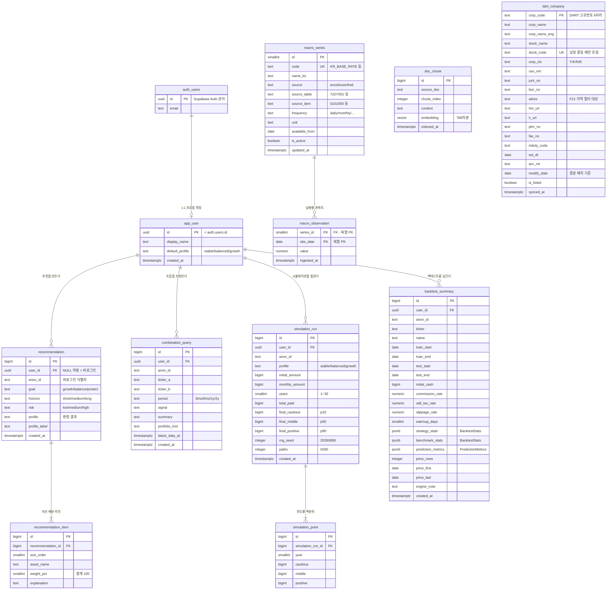

# ERD — 개체 관계도

> - **버전**: v2.1
> - **최종 수정**: 2026-08-10 (KST)
> - **상태**: 초안
> - **기준 코드**: `main` @ `718f161`
> - **DB**: Supabase(Postgres) — [CN-001](../00-index/변경이력.md#cn-001) 확정
> - **역할**: 저장할 개체와 관계를 정의한다. 컬럼 타입·제약의 전문은
>   [`테이블-정의서.md`](테이블-정의서.md) 에 있다.

---

## 0. 이 ERD 를 지배하는 두 가지 원칙

### 0.1 시세 원본은 DB 에 넣지 않는다 (제약 C-04)

Supabase 무료 500MB 제약([CN-001](../00-index/변경이력.md#cn-001)) 때문입니다.
가격 시계열은 **요청 시점에 yfinance·pykrx 로 조회**하고, DB 에는
**사용자가 무엇을 물었고 결과 요약이 무엇이었는지**만 남깁니다.

| DB 에 넣는 것 | DB 에 넣지 않는 것 |
| --- | --- |
| 추천 프로필과 자산 배분 비중 | 일별 종가·거래량 |
| 조회 입력값(티커·기간)과 신호 판정 | `chart_points` (F04 응답의 차트 좌표) |
| 시뮬레이션 입력값과 연도별 백분위 | `curve` (F28 일별 자산곡선) |
| 백테스트 성과 요약 지표 | `rows` (F28 일별 예측 행) |

> 저장하지 않는 4가지는 전부 **시세에서 유도되는 파생물**이라
> 같은 입력으로 다시 계산하면 재현됩니다. 재현 가능성은 아래 0.2 가 보장합니다.

### 0.2 "입력을 저장하면 결과가 재현된다"

F05 는 난수를 쓰지만 **시드가 고정**돼 있습니다.

```python
# app/backend/routers/quant.py:72~73
rng = np.random.default_rng(20260806)
paths = 5_000
```

따라서 `(profile, initial_amount, monthly_amount, years)` 네 값만 저장하면
경로 5,000개가 통째로 재현됩니다. 이것이 `simulation_run` 이 입력값을
반드시 컬럼으로 들고 있어야 하는 이유입니다.

F28 도 같습니다 — `RunRequest` 11개 필드(`app/backend/routers/backtest_lab.py:62~74`)가
곧 재현 키입니다. 다만 F28 은 외부 시세를 받아오므로 **데이터 갱신에 따라 결과가
달라질 수 있어**, 조회한 가격 구간(`price_first`·`price_last`·`price_rows`)을
함께 남겨 그때의 데이터 범위를 증거로 삼습니다
(`app/backend/routers/backtest_lab.py:213~215`).

---

## 1. 전체 관계도



> `doc_chunk` 와 거시지표 2종, `dart_company` 는 다른 테이블과 **외래키 관계가 없습니다.**
> 사용자 데이터가 아니라 **참조 데이터**이기 때문입니다 —
> `doc_chunk` 는 `docs/*.md` 색인(4절), 거시지표는 ECOS·FRED 공개 통계(5절),
> `dart_company` 는 DART 공시정보(6절)입니다.

---

## 2. 요구 4기능이 어디에 앉는가

| 기능 | 등급 | 현재 상태 | 저장 테이블 | 이번 설계로 해소되는 문제 |
| --- | --- | --- | --- | --- |
| **F03** 포트폴리오 추천 | A | **프론트전용** | `recommendation` + `recommendation_item` | 추천이 브라우저 안에서만 일어나 저장·재현·검증이 불가능했음 → [CN-011](../00-index/변경이력.md#cn-011) |
| **F04** 포트폴리오 조합 | A | 동작 | `combination_query` | 무엇을 비교했는지 기록이 남지 않음 |
| **F05** 시뮬레이션 | A | 동작 | `simulation_run` + `simulation_point` | 같음 |
| **F28** 백테스트 검증 | B | 동작(로컬) | `backtest_summary` | 실행할 때마다 결과가 사라짐 |
| **F27** RAG 문서 검색 | A | 동작(Qdrant) | `doc_chunk` | Vercel 에 Qdrant 를 띄울 곳이 없음 → [CN-019③](../00-index/변경이력.md#cn-019) |

### 2.1 F03 의 백엔드화가 이 ERD 의 핵심

F03 은 A등급인데 백엔드가 없습니다. 현재 추천 로직 전부가 이 세 줄입니다.

```javascript
// app/frontend/js/views/portfolioGuide.js:39~43
function suggestedProfile(risk, horizon) {
  if (risk === 'low' || horizon === 'short') return 'stable';
  if (risk === 'high' && horizon === 'long') return 'growth';
  return 'balanced';
}
```

그리고 최종 판정에 `goal` 이 한 번 더 개입합니다.

```javascript
// app/frontend/js/views/portfolioGuide.js:133
const profile = goal === 'protect' ? 'stable'
  : goal === 'growth' && horizon === 'long' && risk !== 'low' ? 'growth'
  : suggestedProfile(risk, horizon);
```

자산 배분 표(`PROFILES`, `portfolioGuide.js:1~37`)도 **프론트 상수**입니다.

**설계 결정.** 판정과 배분표를 **서버로 옮기고**, 배분표는 코드 상수가 아니라
`recommendation_item` 으로 **결과를 스냅샷 저장**합니다.

> ⚠ **판정 규칙은 위 두 조각을 그대로 옮기지 않았습니다.**
> [CN-029](../00-index/변경이력.md#cn-029) 가 규칙 교체를 결정했으므로
> (`stable` 이 27칸 중 19칸이라 R-01 의 "세 갈래" 가 성립하지 않습니다),
> 정본은 [02-포트폴리오 1.4절](../20-기능명세/02-포트폴리오.md#14-v20-판정-규칙--cn-029-결정-고칩니다)
> 의 **점수제 + 안전 가드 3종**이고 구현은
> `app/backend/services/recommendation.py:100~135` 입니다.
> **위 코드 블록은 `718f161` 시점의 기록**이고, 지금 프런트에는 없습니다
> → [CN-085](../00-index/변경이력.md#cn-085) · [CN-092](../00-index/변경이력.md#cn-092).
> **옮긴 것이 그대로인 부분은 배분표입니다** — 값은 한 글자도 바뀌지 않았습니다.

> **왜 배분표를 마스터 테이블로 안 두고 스냅샷으로 두는가.**
> 배분 비중을 나중에 손보면 과거 추천의 근거가 소급해서 바뀝니다.
> 추천 이력은 "그때 무엇을 권했는가" 가 증거이므로 **비중을 그 시점 값으로 박아 둡니다.**
> 마스터 표는 서버 코드(또는 설정)에 두고, 저장은 스냅샷으로 갈라놓습니다.

### 2.2 F03 과 F05 는 프로필 어휘를 공유한다

우연이 아니라 실제로 같은 세 값입니다.

| 출처 | 값 |
| --- | --- |
| F03 `PROFILES` 키 (`portfolioGuide.js:2,13,25`) | `stable` · `balanced` · `growth` |
| F05 `profiles` 키 (`app/backend/routers/quant.py:67~69`) | `stable` · `balanced` · `growth` |
| F05 요청 검증 (`quant.py:51`) | `pattern="^(stable\|balanced\|growth)$"` |

→ **공용 enum `portfolio_profile` 로 묶습니다.** 추천(F03)에서 나온 프로필을
시뮬레이션(F05)에 그대로 넘기는 화면 흐름이 타입 수준에서 보장됩니다.

---

## 3. 비로그인 사용자를 어떻게 다루는가

현재 앱에는 로그인이 없습니다. 인증은 Supabase Auth 내장 50,000 MAU 로 넣기로
했지만([CN-001](../00-index/변경이력.md#cn-001)), **로그인을 강제하면 지금 되던 화면이
안 되게 됩니다.**

**결정.** 이력 4개 테이블은 `user_id UUID NULL` + `anon_id TEXT` 를 함께 가집니다.

| 상태 | `user_id` | `anon_id` | 조회 범위 |
| --- | --- | --- | --- |
| 로그인 | `auth.uid()` | NULL | 본인 전체 이력 |
| 비로그인 | NULL | 브라우저 로컬 UUID | 같은 브라우저의 이력만 |

`anon_id` 는 새로 만들 필요가 없습니다 — 이미 방문자 식별자가 있습니다.

```python
# app/backend/main.py:228
class VisitorHeartbeatRequest(BaseModel):
```

> **한계를 명시합니다.** `anon_id` 는 브라우저 로컬 값이라 **위조할 수 있습니다.**
> 비로그인 이력은 "편의 기능" 이고 보호 대상이 아닙니다. 개인정보를 넣지 않습니다.
> 진짜 보호가 필요한 데이터는 로그인 사용자의 것뿐이고, 그건 RLS 로 막습니다
> ([`테이블-정의서.md` 6절](테이블-정의서.md#6-rls-행-수준-보안)).

---

## 4. `doc_chunk` — Qdrant 를 pgvector 로 대체

### 4.1 결정

[CN-019③](../00-index/변경이력.md#cn-019) 의 두 선택지 중 **ⓐ Supabase pgvector 이관**으로
확정합니다 (2026-08-09 사용자 결정).

**용량이 걸림돌이 아님을 먼저 확인했습니다.**

```
$ python3 -c "…chunk_size=1200, overlap=200 로 docs/*.md 청킹…"     # 2026-08-09 실행
03.md: 44219자 -> 45청크    04.md: 11228자 -> 12청크
05.md: 37021자 -> 37청크    06.md: 17108자 -> 17청크
07.md: 27304자 -> 28청크    10.md:  5346자 ->  6청크
11.md: 11296자 -> 12청크   voca.md: 20271자 -> 21청크
총 청크: 178
```

| 항목 | 값 | 500MB 대비 |
| --- | --- | --- |
| 청크 수 | 178 | — |
| 원문 텍스트 | 361,636 바이트 ≈ 353 KB | 0.07 % |
| 벡터 768차원 float32 | 178 × 768 × 4 = 546,816 B ≈ 534 KB | 0.10 % |
| **합계** | **약 0.9 MB** | **0.2 %** |

청킹 파라미터 출처: `scripts/upload_docs_to_qdrant.sh:11~12`
(`CHUNK_SIZE=1200`, `CHUNK_OVERLAP=200`).

### 4.2 왜 Qdrant Cloud 가 아니라 pgvector 인가

| 판단 근거 | 내용 |
| --- | --- |
| 관리 서비스 수 | pgvector 는 Supabase 1개. Qdrant Cloud 는 Supabase + Qdrant 2개이고, 무활동 정지 정책을 두 벌 관리해야 함 |
| "코드 변경이 적다" 는 이점이 생각보다 작음 | `rag.py` 에 **Qdrant 인증 코드가 아예 없습니다.** `grep -n "api-key\|QDRANT_API" app/backend/routers/rag.py` → **0건** (2026-08-09). Qdrant Cloud 는 `api-key` 헤더가 필수이므로 `rag.py:23,37,46` 3곳과 `upload_docs_to_qdrant.sh` 의 `http_json` 1곳에 헤더 주입이 필요합니다 |
| 용량 제약 | 위 4.1 대로 무관 |

> **대가를 정직하게 적습니다.** pgvector 이관은 `rag.py` 의 Qdrant HTTP 계층
> (`_qdrant_request`·`_qdrant_available`·`_qdrant_collection_available`·`_search`,
> `rag.py:20~68,81~102`)을 **SQL 호출로 교체**해야 합니다. Qdrant Cloud 보다 변경량이 큽니다.
> 그럼에도 ⓐ 를 고른 이유는 **운영할 무료 서비스를 1개로 줄이는 값**이 더 크다고 봤기 때문입니다.

### 4.3 임베딩 — 무료 조건에서의 선택

사용자 요구: **무조건 무료.** 후보를 공식 문서로 확인했습니다 (전부 2026-08-09 확인).

| 후보 | 무료 여부 | 차원 | 한국어 | 판정 |
| --- | --- | --- | --- | --- |
| 현행 `_hash_embed` (`rag.py:52`) | 무료 | 384 | 어휘 일치만 | **의미 검색 아님** → [CN-015](../00-index/변경이력.md#cn-015) |
| Supabase Edge 내장 `gte-small` | 무료 | 384 | **영어 전용** | **탈락** |
| Google `gemini-embedding-001` | **"Free of charge"** | 3072 기본 / 768·1536 절단 | (확인 필요) | **채택** |

**`gte-small` 이 탈락한 이유** — 모델 카드 원문:

> "This model exclusively caters to English texts, and any lengthy texts will be
> truncated to a maximum of 512 tokens."
> — [Supabase/gte-small 모델 카드](https://huggingface.co/Supabase/gte-small) (2026-08-09 확인)

Supabase Edge Runtime 에 내장돼 있어 가장 싸고 편했지만
([Generate Text Embeddings](https://supabase.com/docs/guides/ai/quickstarts/generate-text-embeddings)),
색인 대상 `docs/*.md` 8개가 **전부 한국어**라 쓸 수 없습니다.

**차원을 768 로 정한 이유** — pgvector 의 인덱스 한계 때문입니다.

> "Vectors can have up to 16,000 dimensions" / 인덱스는 "up to 2,000 dimensions"
> — [pgvector README](https://github.com/pgvector/pgvector) (2026-08-09 확인)

`gemini-embedding-001` 의 기본 3072 차원은 **HNSW·IVFFlat 인덱스를 만들 수 없습니다.**
공식 권장 절단값 768 / 1536 / 3072 중
([Embeddings 가이드](https://ai.google.dev/gemini-api/docs/embeddings), 2026-08-09 확인)
**768** 을 선택합니다.

**주의 3가지 — 구현 시 반드시 지켜야 합니다.**

1. **수동 정규화 필요.** 공식 문서: "If you are using `gemini-embedding-001`, you must
   manually normalize non-3072 dimensions." 768 로 절단하면 **직접 L2 정규화**해야
   코사인 거리가 맞습니다.
2. **입력 토큰 상한 2,048.** 현재 청크는 1,200자입니다. 한국어 1,200자가 2,048 토큰
   이내인지는 **(확인 필요 — 실제 색인 시 토큰 수 측정)**. 넘으면 `CHUNK_SIZE` 를 낮춥니다.
3. **무료 티어의 분당·일일 호출 한도는 (확인 필요)**. 공식 rate-limits 페이지가
   수치 대신 AI Studio 확인을 안내합니다
   ([Rate limits](https://ai.google.dev/gemini-api/docs/rate-limits), 2026-08-09 확인).
   색인은 **178회 1번**이라 문제가 없고, 위험은 질의 쪽입니다.

**폴백을 남깁니다.** API 키가 없거나 호출이 실패하면 `_hash_embed` 로 되돌아가
검색이 죽지 않게 합니다. 이때 `doc_chunk.embed_method` 로 어느 방식인지 구분합니다
— **차원이 다른 벡터가 한 컬럼에 섞이면 안 되므로 폴백은 별도 컬럼으로 분리**합니다
([`테이블-정의서.md` 4.7절](테이블-정의서.md#47-doc_chunk--f27-rag-벡터-pgvector)).

---

## 5. 거시지표 2종 — 참조 데이터의 두 번째 사례

### 5.1 결정

[CN-044](../00-index/변경이력.md#cn-044) 가 "거시지표를 DB 에 넣는다" 까지 정하고
테이블 정의를 세션 9로 미뤘습니다. **여기서 마무리합니다.**
컬럼·제약의 전문은 [`테이블-정의서.md` 4.8절](테이블-정의서.md#48-macro_series--macro_observation--거시지표-참조-데이터).

### 5.2 이것은 0.1 원칙의 위반이 아닙니다

0.1 은 **"시세 원본"** 을 넣지 않는다는 원칙이고, 거시지표는 시세가 아닙니다.
**두 축으로 갈립니다.**

| | 시세 (넣지 않음) | 거시지표 (넣음) |
| --- | --- | --- |
| 성격 | 시장이 실시간으로 만드는 값 | **기관이 발표하는 공식 통계** |
| 재조회 | yfinance·pykrx 무인증 · 무료 | **인증 키 · 쿼터 소모** |
| 갱신 | 초·분 | 일·월 |
| 행 수 | 수백만 | **1.7만** |

**결정적인 것은 세 번째 열이 아니라 두 번째 열입니다.** 시세는 다시 부르면 그만이라
저장할 이유가 없지만, 거시지표는 **화면 진입마다 부르면 쿼터를 태웁니다.**
그리고 ECOS·KOSIS·FRED·KRX 의 일일 한도는 아직 **(확인 필요)** 라
([`../20-기능명세/04-거시경제.md` 4.4절](../20-기능명세/04-거시경제.md#44-쿼터--여전히-미확인)),
**한도를 모르는 채로 호출량을 늘리지 않는 쪽**이 안전합니다.

이미 같은 판단을 한 번 했습니다 — [CN-023](../00-index/변경이력.md#cn-023) 의
DART 회사 마스터입니다. **"갱신이 드문 참조 데이터는 넣는다"** 가 C-04 의 예외 규칙이고,
거시지표가 두 번째 사례입니다.

### 5.3 마스터와 관측치를 나눈 이유

`macro_series` (지표가 무엇인가) ↔ `macro_observation` (그 값이 날짜별로 얼마인가).

지표의 **출처 좌표**(ECOS 통계표 `722Y001` · 항목 `0101000`)와 **단위·주기**는
지표당 한 번 정해지고 거의 바뀌지 않습니다. 합치면 그 문자열이 관측치 1.7만 행에
복제되고, **출처 코드가 바뀔 때 1.7만 행을 갱신**해야 합니다.

> `macro_observation` 은 이 ERD 에서 **유일하게 복합 기본키**를 씁니다.
> `(series_id, obs_date)` 가 자연키이고 대리키가 보태는 것이 없기 때문입니다.
> 명명 규칙("기본키는 `id`")을 어기는 의도된 예외이며, 근거는
> [`테이블-정의서.md` 4.8절](테이블-정의서.md#48-macro_series--macro_observation--거시지표-참조-데이터)에 적었습니다.

### 5.4 사용자 데이터와 섞이지 않습니다

`macro_series` · `macro_observation` 은 `app_user` 와 **관계가 없습니다.**
누가 조회했는지 남기지 않고, 배치가 채우고 화면이 읽기만 합니다.
`doc_chunk` 와 같은 자리이며, RLS 도 같습니다 — **공개 SELECT · 쓰기는 서버 경유만**
([`테이블-정의서.md` 6.1절](테이블-정의서.md#61-정책-요약)).

---

## 6. `dart_company` — 참조 데이터의 세 번째 사례

### 6.1 결정

[CN-023](../00-index/변경이력.md#cn-023) 은 DART 회사 마스터를 **"대응 방향 ⓐ DB 참조
테이블로 영속화"** 라고만 적고 결정하지 않았습니다. 그런데 이 문서 5.2절과
[`테이블-정의서.md` 4.8절](테이블-정의서.md#48-macro_series--macro_observation--거시지표-참조-데이터)이
**거시지표 결정의 선례로 인용**했고, [`../60-운영/아키텍처.md`](../60-운영/아키텍처.md) 는
`clients/dart_client.py` 를 그 근거로 배치했습니다. [CN-083](../00-index/변경이력.md#cn-083) 이
이 구멍을 지적했고, **여기서 결정합니다** → [CN-084](../00-index/변경이력.md#cn-084).

**`dart_company` 단일 테이블.** 상장사만 담고, 컬럼·제약의 전문은
[`테이블-정의서.md` 4.9절](테이블-정의서.md#49-dart_company--dart-회사-마스터).

### 6.2 왜 거시지표처럼 둘로 나누지 않았는가

5.3절은 마스터와 관측치를 나눴습니다. **여기서는 나누지 않습니다 — 시계열이 아니기 때문입니다.**

| | 거시지표 | 회사 마스터 |
| --- | --- | --- |
| 값의 축 | 지표 × **날짜** | 회사 **1곳 = 1행** |
| 갱신 방식 | 날짜마다 행이 **추가** | 그 행을 **덮어쓰기** |
| 나누는 이유 | 출처 좌표가 1.7만 행에 복제됨 | **복제될 메타가 없음** |

`company.json` 이 주는 17개 필드는 **전부 그 회사의 현재 상태**입니다.
"고정된 메타" 와 "늘어나는 값" 으로 갈릴 축이 없는데 나누면 조인만 늘어납니다.

### 6.3 0.1 원칙의 세 번째 예외 — 근거는 쿼터입니다

5.2절이 세운 규칙("갱신이 드문 참조 데이터는 넣는다")의 세 번째 적용입니다.
다만 **거시지표보다 근거가 강합니다.** 거시지표는 "쿼터를 태운다" 는 정성적 우려였고
일일 한도도 **(확인 필요)** 였지만, 회사 마스터는 숫자가 다 나와 있습니다.

| | 값 | 근거 |
| --- | --- | --- |
| 상장사 수 | **3,981** | 2026-08-10 실측 (`corpCode.xml` 파싱) |
| 1회 전량 조회 | **3,982건** | 상장사 1곳당 `company.json` 1회 + 목록 1회 |
| DART 일일 한도 | **20,000건** | [개발가이드](https://opendart.fss.or.kr/guide/detail.do?apiGrpCd=DS001&apiId=2019018) (2026-08-09 확인) |
| **하루 가능 횟수** | **5.02회** | 20,000 ÷ 3,982 |

**서버리스에서 이게 무너집니다.** `@lru_cache` 는 프로세스 메모리라
([CN-019](../00-index/변경이력.md#cn-019) Vercel) 인스턴스마다 따로 채워집니다 —
**인스턴스 5개면 그날 한도가 끝납니다.** 저장하지 않으면 F21 화면이 동작하지 않는
날이 생긴다는 뜻이고, "저장하면 편하다" 가 아니라 **"저장하지 않으면 깨진다"** 입니다.

### 6.4 사용자 데이터와 섞이지 않습니다

`dart_company` 는 `app_user` 와 **관계가 없습니다.** 누가 조회했는지 남기지 않고,
배치가 채우고 화면이 읽기만 합니다. `doc_chunk`·거시지표와 같은 자리이며 RLS 도
같습니다 — **공개 SELECT · 쓰기는 배치만**
([`테이블-정의서.md` 6.1절](테이블-정의서.md#61-정책-요약)).

> **저장하는 값이 전부 DART 가 이미 공개한 법인 공시정보입니다.**
> 사업자등록번호·주소·전화번호까지 [DART 기업개황](https://dart.fss.or.kr/) 에서
> 누구나 조회할 수 있습니다. 개인정보가 아니므로 [3절](#3-비로그인-사용자를-어떻게-다루는가)의
> 고민이 여기에는 적용되지 않습니다.

---

## 7. 관계 규칙 요약

| 관계 | 카디널리티 | 삭제 규칙 | 이유 |
| --- | --- | --- | --- |
| `auth.users` → `app_user` | 1 : 0..1 | `ON DELETE CASCADE` | 계정이 지워지면 프로필도 사라져야 함 |
| `app_user` → 이력 4종 | 1 : 0..N | `ON DELETE SET NULL` | 탈퇴해도 **통계용 익명 이력은 남긴다** |
| `recommendation` → `recommendation_item` | 1 : 1..N | `ON DELETE CASCADE` | 아이템만 남으면 의미가 없음 |
| `simulation_run` → `simulation_point` | 1 : 1..N | `ON DELETE CASCADE` | 같음 |
| `macro_series` → `macro_observation` | 1 : 0..N | `ON DELETE CASCADE` | 지표를 지우면 그 값도 의미가 없음. `0..N` 인 것은 **등록만 하고 아직 적재 전인 계열**이 있을 수 있기 때문 |

> **`SET NULL` 을 고른 것은 판단이 필요한 지점입니다.** 탈퇴자의 이력을 남기면
> 통계는 좋아지지만 "지워 달라" 는 요청과 충돌합니다. 이 프로젝트는 이력에
> **개인정보를 저장하지 않으므로**(티커·금액·기간뿐) 익명화 보존으로 정리합니다.
> 개인정보를 넣게 되면 이 결정을 다시 봐야 합니다.

---

## 8. 이 문서가 아직 답하지 않은 것

| # | 미결 | 다음 단계 |
| --- | --- | --- |
| 1 | 한국어 1,200자 청크가 Gemini 2,048 토큰 상한에 걸리는가 | 첫 색인에서 측정 |
| 2 | `gemini-embedding-001` 의 한국어 품질 | 색인 후 "분산투자" ↔ "나누어 담는다" 로 실검색 |
| 3 | Gemini 무료 티어의 분당·일일 한도 수치 | AI Studio 에서 확인 |
| 4 | F28 결과를 로그인 사용자만 저장할지 | F28 은 로컬 전용([CN-019](../00-index/변경이력.md#cn-019))이라 저장 주체가 애매함 |
| 5 | **KOSIS 로 어느 통계표를 쓸지** | 통계표를 실호출로 확정한 뒤 `macro_series` 에 행 추가 (5절) |
| 6 | **`KR_USD_KRW` 가 영업일인가 달력일인가** | 첫 배치에서 행 수로 확인. 용량 결론은 어느 쪽이든 바뀌지 않음 |
| ~~7~~ | ~~DART 회사 마스터의 테이블 정의~~ | **해소됨** — 6절 · [`테이블-정의서.md` 4.9절](테이블-정의서.md#49-dart_company--dart-회사-마스터) ([CN-084](../00-index/변경이력.md#cn-084)) |
| 8 | **상장폐지된 종목코드를 KRX 가 다른 회사에 재배정하는가** | 재배정이 없으면 `uq_dart_company_stock_code` 의 부분 인덱스 조건(`where is_listed`)을 뺄 수 있음. 배치 운영 중 충돌 발생 여부로 확인 ([`테이블-정의서.md` 4.9절](테이블-정의서.md#49-dart_company--dart-회사-마스터)) |
| 9 | **DART 동시 8스레드가 `012`(접근할 수 없는 IP)를 유발하는가** | 30 → 8 로 낮춘 것은 예방이고 **임계값은 모릅니다.** 첫 전량 적재(3,981건) 로그에서 확인 |

---

## 관련 문서

- [`테이블-정의서.md`](테이블-정의서.md) — 컬럼·타입·제약·인덱스·마이그레이션 SQL
- [`외부-데이터소스.md`](외부-데이터소스.md) — DART·yfinance·pykrx 출처와 쿼터
- [`../20-기능명세/04-거시경제.md`](../20-기능명세/04-거시경제.md) — 거시지표를 쓰는 화면(F13·F14)
- [`../00-index/기능ID-대장.md`](../00-index/기능ID-대장.md) — F03·F04·F05·F27·F28 정의
- [`../20-기능명세/05-산업과-기업.md`](../20-기능명세/05-산업과-기업.md) — 6절 회사 마스터를 쓰는 화면(F20~F23)
- [`../00-index/변경이력.md`](../00-index/변경이력.md) — CN-001 · CN-011 · CN-015 · CN-019 · CN-023 · CN-044 · CN-083 · CN-084
