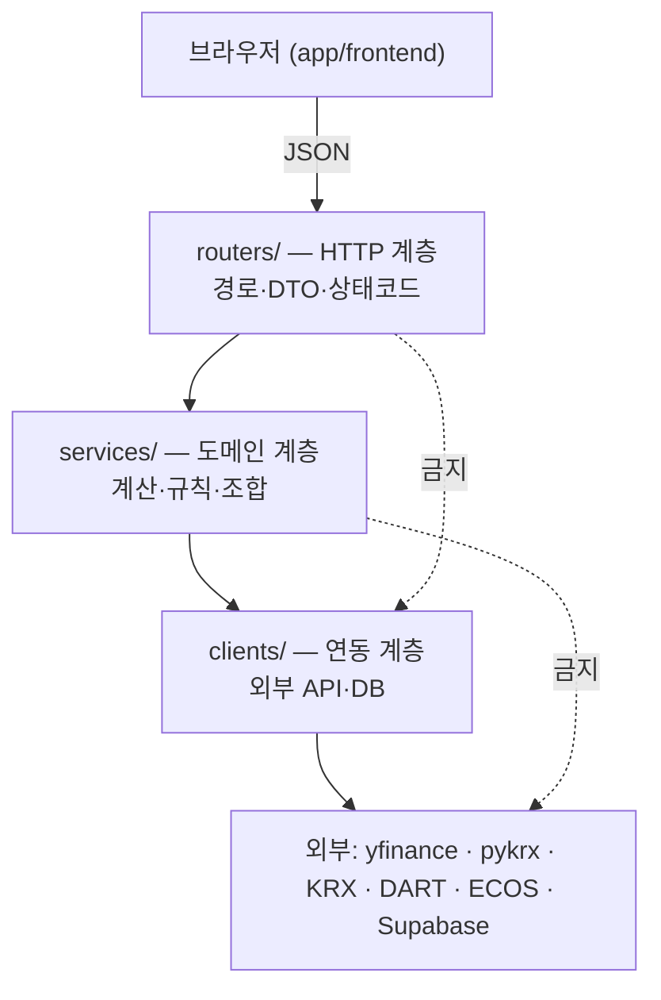

# 아키텍처

> - **버전**: v2.1
> - **최종 수정**: 2026-08-10 (KST)
> - **상태**: 초안
> - **기준 코드**: `main` @ `718f161`
> - **역할**: [D-02](../00-index/마스터인덱스.md#2-지금-확정된-설계-결정)("`main.py` 를 3단계
>   Layered 로 분해한다")가 **어디에 어떻게 착지하는지**를 확정한다.
> - **관련**: [CN-013](../00-index/변경이력.md#cn-013) 빈 `services/` ·
>   [CN-023](../00-index/변경이력.md#cn-023) · [CN-037](../00-index/변경이력.md#cn-037) 캐시 ·
>   [CN-039](../00-index/변경이력.md#cn-039) F03 신설 API ·
>   [CN-047](../00-index/변경이력.md#cn-047) 프론트전용 판단

---

## 0. 한 장 요약

| 항목 | 지금 | v2.0 목표 |
| --- | --- | --- |
| `main.py` | **2,689 줄 / 115,272 B** | **200 줄 미만** (앱 조립만) |
| 계층 | 라우터 1겹 | **routers → services → clients** 3겹 |
| `app/backend/services/` | `__init__.py` 31 B **뿐** | 도메인 서비스 8개 |
| `app/backend/clients/` | **폴더 자체가 없음** | 외부 연동 5개 |
| 라우트 핸들러가 외부 API 를 직접 호출 | **22개 중 12개** | **0개** |
| 라우트 핸들러가 차트를 직접 그림 | **22개 중 6개** | **0개** |
| 같은 함수의 중복 정의 | **2종 5벌** | 1벌씩 |

> 이 문서는 **코드를 옮기는 계획서**입니다. 새 기능을 넣지 않습니다.
> 유일한 신규는 [CN-039](../00-index/변경이력.md#cn-039) 가 이미 확정한 F03 백엔드 4개이고,
> 그것도 **이 구조의 첫 적용 사례**로만 다룹니다.

---

## 1. 현재 구조 실측 (2026-08-10)

### 1.1 파일과 크기

```
$ find app/backend -name "*.py" | xargs wc -l -c | sort -k1 -n     # 실측 2026-08-10
     1     28  app/backend/routers/__init__.py
     1     31  app/backend/services/__init__.py        ← 빈 껍데기 (CN-013)
    40   2011  app/backend/indicators.py
    63   2612  app/backend/charting.py
   181  17817  app/backend/openapi_docs.py
   207   9491  app/backend/routers/rag.py
   300  12487  app/backend/routers/backtest_lab.py
   368  15118  app/backend/routers/tax.py
   712  32823  app/backend/routers/quant.py
   844  31489  app/backend/routers/ml.py
  2688 115272  app/backend/main.py
  5405 239179  total
```

**`main.py` 하나가 백엔드 전체의 49.7 %(줄 기준 2,688 / 5,405)입니다.**

### 1.2 `main.py` 안에 무엇이 들어 있나

AST 로 최상위 정의만 뽑았습니다.

| 구성 | 개수 | 줄 수 | 비중 |
| --- | ---: | ---: | ---: |
| **라우트 핸들러** | **22** | **1,710** | **63.6 %** |
| 미들웨어 | 1 | 16 | 0.6 % |
| 헬퍼 함수 | 17 | 525 | 19.5 % |
| Pydantic 모델 | 15 | 60 | 2.2 % |
| import · 앱 설정 · 상수 | — | 378 | 14.1 % |
| **합계** | | **2,689** | 100 % |

**가장 긴 라우트 5개가 라우트 전체 줄 수의 45.8 %(783 / 1,710)를 차지합니다.**

| 라우트 | 줄 수 | 위치 |
| --- | ---: | --- |
| `POST /api/macro/kospi-ex` | **210** | `main.py:1590~1799` |
| `POST /api/macro/realtime` | **182** | `main.py:1363~1544` |
| `POST /api/finance/company-financials` | 149 | `main.py:1965~2113` |
| `POST /api/macro/simulation` | 124 | `main.py:1833~1956` |
| `POST /api/industry/lifecycle` | 118 | `main.py:972~1089` |

> **210 줄짜리 함수 하나가 "HTTP 파싱 → 외부 시세 조회 → 계산 → 차트 그리기 →
> 응답 조립" 을 전부 합니다.** 이것이 [CN-003](../00-index/변경이력.md#cn-003) SI 합격선의
> "계층 분리" 축이 지금 ❌ 인 이유입니다.

### 1.3 라우트 22개가 직접 하는 일

각 핸들러 본문에서 무엇을 부르는지 전수 조사했습니다 (2026-08-10, AST + 정규식).

| 라우트 | 줄 | yfinance | pykrx | DART | 차트 | 캐시함수 |
| --- | ---: | :---: | :---: | :---: | :---: | :---: |
| `GET /api/health` | 2 | | | | | |
| `GET /api/system/resources` | 31 | | | | | |
| `POST /api/visitors/heartbeat` | 19 | | | | | |
| `POST /api/dart/company-search` | 32 | | | | | ✅ |
| `POST /api/dart/group-network` | 60 | | ✅ | | | ✅ |
| `POST /api/dart/company-list` | 46 | | | | | ✅ |
| `POST /api/industry/porter` | 117 | | | | ✅ | |
| `POST /api/industry/sector` | 103 | ✅ | | | ✅ | |
| `POST /api/industry/peer` | 82 | ✅ | | | | |
| `POST /api/industry/lifecycle` | 118 | | | | ✅ | |
| `POST /api/market/portfolio-combination` | 76 | ✅ | | | | |
| `POST /api/market/snapshot` | 53 | ✅ | | | | |
| `GET /api/market/volume-cloud` | 58 | ✅ | | | | |
| `POST /api/macro/realtime` | 182 | ✅ | | | ✅ | |
| `POST /api/macro/kospi-ex` | 210 | ✅ | | | ✅ | |
| `GET /api/macro/kospi-ex/meta` | 9 | | | | | |
| `POST /api/macro/simulation` | 124 | | | | ✅ | |
| `POST /api/finance/company-financials` | 149 | ✅ | | | | |
| `GET /api/home/market-candle` | 53 | ✅ | | | | |
| `GET /api/home/kospi-candle` | 3 | | | | | |
| `GET /api/home/box-range` | 84 | ✅ | | | | |
| `POST /api/dart/financial-analysis` | 99 | | | ✅ | | ✅ |
| **합계 (22개 중)** | | **10** | **1** | **1** | **6** | **4** |

**외부 API 를 핸들러 안에서 직접 부르는 것이 12개(10 + 1 + 1)입니다.**
`import yfinance as yf` 가 **함수 안에서 10번 반복**됩니다
(`main.py:755,863,1171,1249,1306,1364,1591,1968,2132,2209`).

> 지연 import 자체는 의도된 것입니다 — 무거운 패키지를 요청 시점까지 미룹니다
> (`indicators.py:20~22` 주석이 같은 이유를 적습니다). **문제는 import 위치가 아니라
> "라우트 핸들러가 외부 시스템을 직접 안다" 는 것**입니다.

### 1.4 `services/` 는 빈 껍데기입니다 — CN-013

```
$ ls -la app/backend/services/ && cat app/backend/services/__init__.py
-rwxrwxrwx 1 dongwon dongwon 31 Aug  3 11:19 __init__.py
"""Shared backend services."""
```

**파일 하나, 31 바이트, docstring 한 줄이 전부입니다.**
자리는 만들어 뒀는데 아무것도 들어오지 않았습니다. D-02 가 착지할 곳이 여기입니다.

### 1.5 그런데 준(準)-서비스가 이미 2개 있습니다

`services/` 는 비었지만, **같은 목적의 모듈이 `app/backend/` 바로 아래에 두 개** 있습니다.

| 모듈 | 줄 | 내용 | 쓰는 곳 |
| --- | ---: | --- | --- |
| `charting.py` | 63 | `configure_matplotlib_korean_font(plt)` | `quant.py:13` |
| `indicators.py` | 40 | `calc_rsi(series, period)` | `quant.py:14` |

두 모듈의 docstring 이 **자기가 왜 생겼는지와 앞으로 할 일까지 적어 놓았습니다.**

> "`main.py` 와 `routers/ml.py` 에도 같은 함수의 사본이 각각 남아 있다. 동작에는
> 문제가 없어 v1.0 에서는 건드리지 않았지만, **설계 정리 단계에서 이 모듈 하나로
> 합쳐야 한다.**" — `charting.py:22~26`

**이 문서가 그 "설계 정리 단계" 입니다.** 두 모듈은 `services/` 로 옮기면 그대로 맞습니다.

### 1.6 중복 정의 2종 5벌 — 실측

```
$ grep -rn "^def configure_matplotlib_korean_font" app/backend/    # 실측 2026-08-10
charting.py:43        routers/ml.py:21        main.py:61            ← 3벌
$ grep -rn "^def .*calc_rsi" app/backend/
indicators.py:25 (calc_rsi)     main.py:588 (_calc_rsi)             ← 2벌
```

### 1.7 이중 import 블록 4곳

```python
# app/backend/main.py:109~120 (같은 패턴이 main.py:33·38, quant.py:15 에도)
try:
    from .routers.ml import router as ml_router
    …
except ImportError:  # Allows `uvicorn main:app` from app/backend.
    from routers.ml import router as ml_router  # type: ignore
```

**같은 import 를 상대·절대 두 벌로 적는 곳이 4군데**입니다
(`main.py:33,38,110` · `quant.py:15`). 실행 디렉터리에 따라 패키지 경로가 달라지는 것을
try/except 로 흡수하고 있습니다. 계층을 나누면 모듈 수가 늘어나므로 **이 패턴을 먼저
정리하지 않으면 같은 블록이 8~10곳으로 번집니다.**

### 1.8 라우터 등록이 파일 양 끝으로 갈라져 있습니다

```python
app/backend/main.py:116~118   app.include_router(ml_router / quant_router / backtest_lab_router)
app/backend/main.py:2686~2687 app.include_router(tax_router / rag_router)
```

**2,570 줄 떨어진 두 곳에서 라우터를 등록합니다.** 사이에 낀 주석
(`main.py:119~120`)이 "아래에서도 등록한다" 고 밝히고 있어 실수는 아니지만,
**등록 지점이 하나가 아니라는 사실 자체가 조립부와 구현부가 섞여 있다는 증거**입니다.

---

## 2. v2.0 목표 구조

### 2.1 세 계층의 책임



| 계층 | 하는 일 | **하지 않는 일** |
| --- | --- | --- |
| `routers/` | 경로 선언, 요청 DTO 검증, 서비스 호출, HTTP 상태코드 결정 | 계산, 외부 호출, 차트 |
| `services/` | 도메인 계산, 판정 규칙, 여러 소스 조합, 캐시 정책 결정 | HTTP 를 알기, `HTTPException` 던지기 |
| `clients/` | 외부 API 호출, 재시도, 응답 파싱, DB 접근 | 도메인 판단 |

**의존은 한 방향입니다.** `routers → services → clients`.
역방향 import 는 금지이고, `routers` 가 `clients` 를 건너뛰어 부르는 것도 금지입니다.

> `services/` 가 `HTTPException` 을 던지지 않는 이유: 던지는 순간 서비스가 HTTP 를
> 알게 되어 **배치·스크립트에서 재사용할 수 없습니다.**
> [CN-044](../00-index/변경이력.md#cn-044) 의 거시지표 일 1회 로컬 배치와
> [CN-023](../00-index/변경이력.md#cn-023) 의 DART 마스터 갱신 배치가 바로 그 재사용처입니다.
> **후자는 [CN-084](../00-index/변경이력.md#cn-084) 로 확정됐습니다** — `dart_company` 를
> `modify_date` 증분으로 갱신하는 일 1회 로컬 배치입니다 (일 약 6건).
> 서비스는 도메인 예외를 던지고, **라우터가 그것을 HTTP 코드로 번역**합니다
> ([CN-036](../00-index/변경이력.md#cn-036) 코드 정책과 짝을 이룹니다).

### 2.2 폴더 배치

```
app/backend/
├── main.py                 앱 조립만 (200줄 미만 목표)
├── openapi_docs.py         (현행 유지)
├── routers/
│   ├── home.py             F01      market-candle · snapshot · box-range
│   ├── recommendation.py   F03      preview · create · history · detail   ← CN-039
│   ├── market.py           F04·F10~F12
│   ├── macro.py            F13~F15
│   ├── industry.py         F16~F23
│   ├── dart.py             F17·F23
│   ├── quant.py            F05~F09  (현행 유지)
│   ├── rag.py              F27      (현행 유지)
│   ├── tax.py              F26      (현행 유지)
│   ├── backtest_lab.py     F28      (현행 유지)
│   ├── ml.py               A01~A08  (아카이브)
│   └── system.py           health · resources · visitors
├── services/
│   ├── recommendation.py   F03 판정 규칙 (CN-029 신규 점수제)
│   ├── portfolio.py        F04·F05·F06 조합·시나리오·최적화
│   ├── macro.py            F13~F15 지표 조합
│   ├── industry.py         F16~F23 산업·기업 분석
│   ├── financial.py        DART 재무 파싱·비율·점수 (CN-046 반영)
│   ├── charting.py         ← 현행 app/backend/charting.py 이동
│   ├── indicators.py       ← 현행 app/backend/indicators.py 이동
│   └── cache.py            TTL 캐시 (CN-037)
└── clients/
    ├── yfinance_client.py  해외 시세
    ├── krx_client.py       한국 시세 (CN-045)
    ├── dart_client.py      전자공시 (CN-023·CN-037 → CN-084 로 확정)
    ├── ecos_client.py      한국은행·KOSIS·FRED (CN-044)
    └── supabase_client.py  DB·pgvector (CN-021)
```

### 2.3 `main.py` 에 남는 것

앱 조립에 필요한 것만 남깁니다.

| 남김 | 근거 |
| --- | --- |
| `FastAPI(...)` 생성 | `main.py:83~91` |
| 미들웨어 등록 (GZip · CORS · **보안 헤더** · 캐시) | `main.py:93~101` + [보안과-시크릿 2절](보안과-시크릿.md#2-보안-응답-헤더--cn-034-해소) |
| 예외 핸들러 3개 등록 | [CN-036](../00-index/변경이력.md#cn-036) |
| `include_router` **한 곳에 모음** | 현행 1.8절의 두 곳을 합침 |
| `install_openapi(app)` | `main.py:2688` |
| `StaticFiles` 마운트 | `main.py:2690` — 단, [배포-전략 4절](배포-전략.md#4-정적-자산을-함수에서-떼어냅니다) 참고 |

### 2.4 옮길 곳이 정해진 것 — 실측 대응표

| 지금 | 옮길 곳 |
| --- | --- |
| `main.py:61` `configure_matplotlib_korean_font` | **삭제** → `services/charting.py` 1벌 |
| `routers/ml.py:21` 같은 함수 | **삭제** → 〃 |
| `main.py:588` `_calc_rsi` | **삭제** → `services/indicators.py` 1벌 |
| `main.py:254~261` `_dart_api_key` | `clients/dart_client.py` |
| `main.py:264~296` `_load_dart_corp_codes` | 〃 |
| `main.py:453~463` `_fetch_company_detail` | 〃 |
| `main.py:467~499` `_load_all_listed_details` | 〃 (+ **`dart_company` 조회로 대체** — [CN-084](../00-index/변경이력.md#cn-084)). 콜드 1회 **3,981건** 이 **0건** 이 됩니다 |
| `main.py:503~536` `_fetch_emp_count` | 〃 |
| `main.py:300~320` `_resolve_krx_yahoo_ticker` | `clients/krx_client.py` ([CN-045](../00-index/변경이력.md#cn-045)) |
| `main.py:359~386` `_pykrx_market_data` | 〃 |
| `main.py:2283~2324` `_parse_dart_amounts` | `services/financial.py` |
| `main.py:2327~2359` `_calc_dart_ratios` | 〃 |
| `main.py:2362~2411` `_score_financial_health` | 〃 ([CN-046](../00-index/변경이력.md#cn-046) 결측 처리 함께) |
| `main.py:2414~2577` `_generate_dart_analysis` | 〃 |
| `main.py:1802~1811` `_build_excl_label` | `services/macro.py` |
| `main.py:1160~1164` `_extract_close_series` | `services/portfolio.py` |
| `main.py:164~191` `_read_cpu_times` · `_memory_usage` | `routers/system.py` (외부 연동 아님) |

**17개 헬퍼 중 15개가 옮길 곳이 이미 정해집니다.** 나머지 2개(`_read_cpu_times`·
`_memory_usage`)는 `/proc` 을 읽는 시스템 조회라 라우터 곁에 두는 편이 낫습니다.

---

## 3. 분해 순서

한 번에 다 옮기면 무엇이 깨졌는지 알 수 없습니다. **작은 것부터, 검증 가능한 순서로** 갑니다.

| # | 단계 | 대상 | 왜 이 순서인가 |
| --- | --- | --- | --- |
| 1 | **중복 제거** | `charting.py`·`indicators.py` 를 `services/` 로 옮기고 사본 3벌 삭제 | 동작 변화 0. 되돌리기 쉬움. `services/` 가 비어 있지 않게 됨 |
| 2 | **이중 import 정리** | `main.py:33,38,110` · `quant.py:15` | 모듈이 늘기 **전에** 해야 번지지 않음 |
| 3 | **clients/ 신설** | DART 5함수 → `dart_client.py` | 캐시·쿼터 문제([CN-037](../00-index/변경이력.md#cn-037))가 한 파일에 모여 고치기 쉬워짐 |
| 4 | **F03 신설** | `routers/recommendation.py` + `services/recommendation.py` | **새 코드라 옮길 것이 없음.** 3계층의 본보기를 먼저 만든다 |
| 5 | **큰 라우트 분해** | `macro/kospi-ex`(210) · `macro/realtime`(182) 부터 | 가장 크고, [CN-045](../00-index/변경이력.md#cn-045) KRX 이관 대상이라 어차피 손댐 |
| 6 | **나머지 라우터 분리** | `main.py` 의 22개를 도메인별 파일로 | 앞이 끝나면 기계적인 이동 |
| 7 | **`main.py` 정리** | 조립만 남김 | 마지막 |

> **4번을 5번보다 먼저 두는 이유.** 기존 코드를 옮기면서 동시에 구조를 배우면
> "원래 이랬던 것" 과 "내가 바꾼 것" 이 섞입니다. F03 은 [CN-039](../00-index/변경이력.md#cn-039)
> 로 설계가 이미 확정된 **신규** 코드라, 3계층을 처음부터 그대로 쓸 수 있습니다.
> 여기서 나온 모양을 나머지에 복사합니다.

---

## 4. 서버리스가 구조에 강제하는 것

[D-06](../00-index/마스터인덱스.md#2-지금-확정된-설계-결정)(Vercel 배포)이 정해졌으므로,
**프로세스가 오래 살아 있다는 전제를 쓰는 코드는 전부 계층 이동 대상**입니다.

### 4.1 모듈 수준 가변 상태 5곳 — 실측

```
$ grep -rn "^_[a-z_]* *[:=]\|Lock()\|global " app/backend/       # 실측 2026-08-10
main.py:57               _active_visitors: dict[str, float] = {}
main.py:58               _active_visitors_lock = Lock()
main.py:63               global _MATPLOTLIB_FONT_CONFIGURED
routers/backtest_lab.py:58  _price_cache: dict[...] = {}
routers/backtest_lab.py:59  _cache_lock = Lock()
routers/ml.py:18,22      _matplotlib_font_configured
```

| 상태 | 지금 동작하는 이유 | 서버리스에서 |
| --- | --- | --- |
| `_active_visitors` (F02 동시접속자) | `Dockerfile:34` `CMD` 에 `--workers` 가 없어 **단일 프로세스** | 인스턴스마다 따로 세어 **숫자가 틀림** |
| `_price_cache` (F28, TTL 900초) | 〃 | 콜드 스타트마다 비어 Yahoo 재조회 |
| `lru_cache` 6곳 | 〃 | [CN-037](../00-index/변경이력.md#cn-037) — 인스턴스 × 수천 건 |
| 폰트 설정 플래그 2개 | 〃 | 무해 (인스턴스마다 한 번 더 할 뿐) |

**`_active_visitors` 가 가장 명확한 사례입니다.** 프로세스 메모리로 세는 동시접속자는
인스턴스가 둘로 늘어나는 순간 **둘 다 틀린 값**을 냅니다.
→ `services/cache.py` 로 추상화하고, 정확성이 필요하면 DB(Supabase)로 옮깁니다.

### 4.2 계층 분리가 이 문제를 푸는 방식

캐시를 **호출부에 흩뿌리지 않고 `clients/` 와 `services/cache.py` 뒤로 숨기면**,
저장소를 프로세스 메모리 → DB 로 바꾸는 것이 **한 파일 교체**가 됩니다.
지금은 `lru_cache` 데코레이터가 6개 함수에 직접 붙어 있어
([CN-037](../00-index/변경이력.md#cn-037)) 바꾸려면 6곳을 다 고쳐야 합니다.

---

## 5. 판정 방법

[CN-003](../00-index/변경이력.md#cn-003) 이 정한 SI 합격선 8축 중 **"계층 분리"** 축을
이 문서가 담당합니다. 말이 아니라 **명령으로 판정**합니다.

| # | 합격 조건 | 판정 명령 |
| --- | --- | --- |
| 1 | `main.py` 200줄 미만 | `wc -l app/backend/main.py` |
| 2 | 라우터가 외부 API 를 직접 부르지 않음 | `grep -rn "yf\.\|krx\.\|urlopen" app/backend/routers/` → **0건** |
| 3 | 라우터가 차트를 직접 그리지 않음 | `grep -rn "savefig\|b64encode" app/backend/routers/` → **0건** |
| 4 | 서비스가 HTTP 를 모름 | `grep -rn "HTTPException\|fastapi" app/backend/services/` → **0건** |
| 5 | 역방향 의존 없음 | `grep -rn "from ..routers\|from ..services" app/backend/clients/` → **0건** |
| 6 | 중복 정의 없음 | `grep -rn "^def configure_matplotlib_korean_font" app/backend/` → **1건** |
| 7 | **`api.js` 외 프론트 파일이 `fetch` 를 직접 부르지 않음** | `grep -rn "fetch(" app/frontend/js/ --include=*.js` (`api.js` 제외) → **0건** |

> 7개 명령이 전부 통과하면 이 축은 ✅ 입니다. **하나라도 실패하면 ❌ 입니다.**
> "대체로 나눠져 있다" 같은 판정을 하지 않기 위해 이렇게 적습니다.

### 5.1 7번이 나중에 붙은 이유 (2026-08-16)

1~6번은 전부 `app/backend/` 를 봅니다. **7번만 `app/frontend/js/` 를 봅니다.**
축을 넓힌 것이 아니라, 같은 축의 프론트 쪽 절반이 그때까지 비어 있었습니다 —
[공통-응답과-에러 §9](../40-API/공통-응답과-에러.md) 조치 9번이 *"`api.js` 를 단일
창구로"* 를 이미 **축: 계층 분리** 로 분류해 두었습니다.

붙인 계기는 API 계약입니다. `quant-contract/docs/contracts/api-contract.md` §8.1 이
계약의 **선행 조건**으로 이 검사를 지목했습니다 — 2026-08-16 오전 실측으로
`api.js` 밖에서 `fetch()` 를 부르는 곳이 **7개 파일 10건**이었고, 받는 쪽이 8곳이면
계약을 아무리 잘 써도 강제되지 않기 때문입니다.

같은 날 오후에 10건을 0건으로 회수한 뒤 이 규칙을 넣었습니다. 판정은
`scripts/check_layers.py` 규칙 7번이고, `sourcetext.code_only()` 가 JS 주석을 걷은
뒤에 셉니다(4번에서 겪은 오탐을 똑같이 피하기 위해서입니다).

---

## 6. 이 문서가 정하지 않는 것

| 항목 | 어디서 정하나 |
| --- | --- |
| 어떤 패키지를 배포에 넣는가 | [배포-전략 3절](배포-전략.md#3-500-mb-안에-들어가는가--cn-019-의-확인-필요-해소) |
| 차트를 서버에서 그릴 것인가 | 〃 — **이 결정이 `services/charting.py` 의 운명을 바꿉니다** |
| LEAN 을 어떻게 돌리는가 | [LEAN-백테스트-운영](LEAN-백테스트-운영.md) |
| 보안 미들웨어의 내용 | [보안과-시크릿 2절](보안과-시크릿.md#2-보안-응답-헤더--cn-034-해소) |
| 각 계층을 어떻게 검증하는가 | [테스트-계획 5절](테스트-계획.md#5-자동화할-수-있는-최소셋) |

---

## 7. 남은 확인 사항

| # | 내용 | 상태 |
| --- | --- | --- |
| 1 | `openapi_docs.py`(181줄)의 `FRONTEND_API_PATHS` 는 경로 문자열 목록이라 라우터를 쪼개면 **경로가 그대로여도 갱신이 필요한지** | **(확인 필요)** — 경로는 안 바뀌므로 무영향일 가능성이 높으나 분해 후 실측 |
| 2 | `routers/ml.py`(844줄)를 아카이브 등급으로 두면 3계층 규칙을 **면제할 것인가** | 5절 판정 명령이 `routers/` 전체를 훑으므로 **면제하면 판정이 흐려집니다.** 폐기(X01~X05) 후 남는 A01~A08 도 같은 규칙을 적용하는 쪽으로 봅니다 |
</content>
</invoke>
